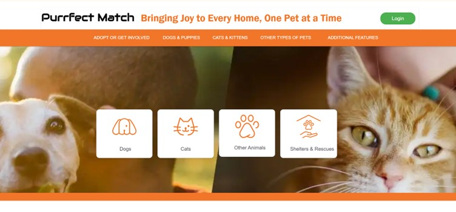
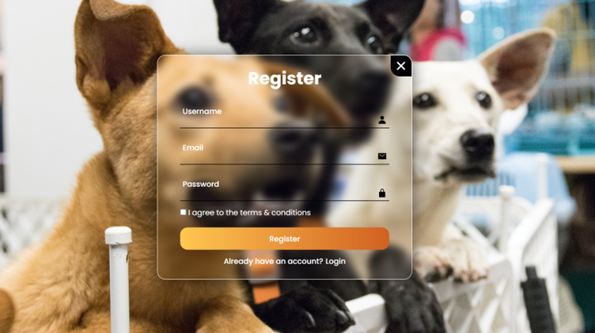
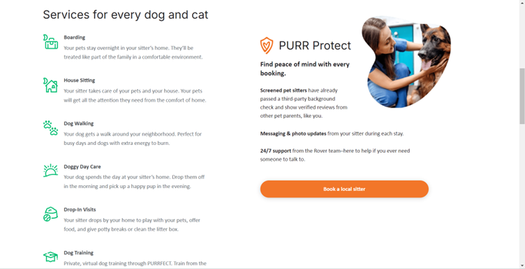
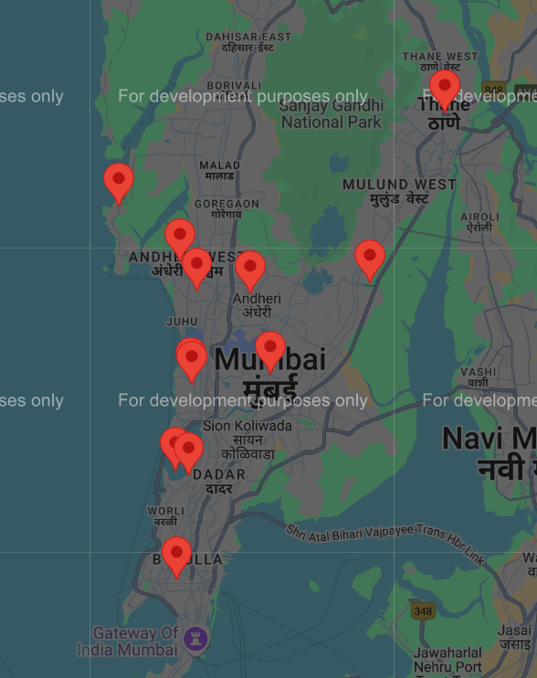

# Purrfect Match

## Problem Statement

Pet Adoption PlatformDevelop a platform that streamlines the pet adoption process , increases visibility for pets in shelters , and improves the overall experience for both potential adopters and shelter staff.

## Features

- User Authentication: Secure login and registration for both staff and adopters.
- Pet Listing and Visibility: Users can browse available pets for adoption, with detailed listings to improve visibility.
- Pet Profiles: Comprehensive profiles for dogs, cats, and other animals, showcasing their characteristics, needs, and adoption status.
- Events and Campaigns: Information on upcoming adoption events and fundraising campaigns.
- Reporting and Analytics: Tools for shelter staff to track adoptions and analyze data for better decision-making.
- Integration with Local Veterinary Clinics: Utilizes Google Maps to connect pet owners with nearby veterinary services.
- Pet Sitter Feature: Allows pet owners to find pet sitters when they are at work or unavailable.
- Report Abandoned or Injured Pets: Users can report found abandoned or injured pets directly to an NGO for assistance.

## Contributors

- [Shane Dias](https://github.com/Shane-Dias)
- [code-runner1306
  ](https://github.com/code-runner1306)
- [Jacell](https://github.com/JACELL100)
- [Mayank](https://github.com/ImpactG1)

## Technology Used

### Frontend

- HTML
- CSS
- JavaScript

### Backend

- Flask
- SQLAlchemy
- SQLite
- Werkzeug

## Tools

- Node js
- Google Maps API

## Screenshots
### Homepage

### Register/Login 

### Pet Sitter

### Nearby Vets to me
